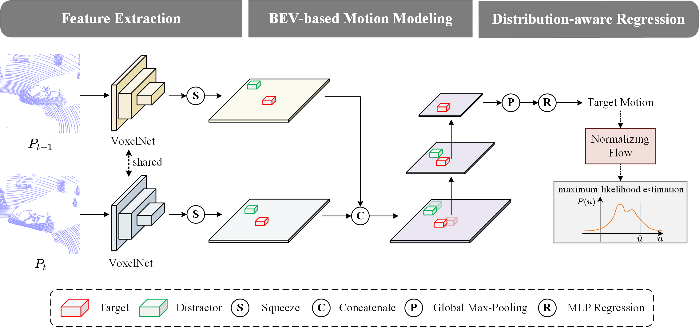

# BEVTrack
This repo is the official implementation of ["BEVTrack: A Simple and Strong Baseline for 3D Single Object Tracking in Bird’s-Eye View"](https://arxiv.org/pdf/2309.02185). It currently includes the testing code and models for 3D single object tracking.
An open source platform for general 3D single object tracking, based on [OpenMMlab](https://github.com/open-mmlab/mmdetection3d).

### Features
+ Modular design. It is easy to config the model and training/testing behaviors through just a `.py` file.
+ DDP support for both training and testing.
+ Support all common tracking datasets (KITTI, NuScenes, Waymo Open Dataset).

### Introduction
3D Single Object Tracking (SOT) is a fundamental task of computer vision, proving essential for applications like autonomous driving. It remains challenging to localize the target from surroundings due to appearance variations, distractors, and the high sparsity of point clouds. To address these issues, prior Siamese and motion-centric trackers both require elaborate designs and solving multiple subtasks. In this paper, we propose BEVTrack, a simple yet effective baseline method. By estimating the target motion in Bird's-Eye View (BEV) to perform tracking, BEVTrack demonstrates surprising simplicity from various aspects, i.e., network designs, training objectives, and tracking pipeline, while achieving superior performance. Besides, to achieve accurate regression for targets with diverse attributes (e.g., sizes and motion patterns), BEVTrack constructs the likelihood function with the learned underlying distributions adapted to different targets, rather than making a fixed Laplacian or Gaussian assumption as in previous works. This provides valuable priors for tracking and thus further boosts performance. While only using a single regression loss with a plain convolutional architecture, BEVTrack achieves state-of-the-art performance on three large-scale datasets, KITTI, NuScenes, and Waymo Open Dataset while maintaining a high inference speed of about 200 FPS.



## Main Results on SOT Benchmarks with Pretrained Models
**KITTI**
|  Category  | Success | Precision |             Config             |                          Checkpoint                          |
| :--------: | :-----: | :-------: | :----------------------------: | :----------------------------------------------------------: |
|    Car     |  74.91  |   86.49   | [config](configs/kitti/car.py) | [baidu](https://pan.baidu.com/s/17VDBmVmiPx0X19vYUYkQQw?pwd=1234)/[onedrive](https://1drv.ms/u/s!AlayK3RgAcdLc7kludVmf_G5yZQ?e=GOrbO1) |
| Pedestrian |  69.50  |   94.34   | [config](configs/kitti/ped.py) | [baidu](https://pan.baidu.com/s/1Fm25OGbs8hAkXjnGYrYBWw?pwd=1234)/[onedrive](https://1drv.ms/u/s!AlayK3RgAcdLddObRj7aj6RnMGs?e=w7OeDK) |
|    Van     |  66.02  |   77.24   | [config](configs/kitti/van.py) | [baidu](https://pan.baidu.com/s/12H4561UFkmRi6M8urBgtkw?pwd=1234)/[onedrive](https://1drv.ms/u/s!AlayK3RgAcdLdlnFC43htDpFu2A?e=fsSsu0) |
|  Cyclist   |  76.99  |   94.69   | [config](configs/kitti/cyc.py) | [baidu](https://pan.baidu.com/s/1xRUm8IMJDB4HYcrxpjJuKA?pwd=1234)/[onedrive](https://1drv.ms/u/s!AlayK3RgAcdLdI7BVJU-nruzLl4?e=wCRiQN) |

**NuScenes**
|  Category  | Success | Precision |                Config                 |                          Checkpoint                          |
| :--------: | :-----: | :-------: | :-----------------------------------: | :----------------------------------------------------------: |
|    Car     |  64.31  |   71.14   |   [config](configs/nuscenes/car.py)   | [baidu](https://pan.baidu.com/s/1U1QieSe37obO7yDEvIOi3A?pwd=1234)/[onedrive](https://1drv.ms/u/s!AlayK3RgAcdLdwDflTi4b4LoPJc?e=IcQRUh) |
| Pedestrian |  46.28  |   76.77   |   [config](configs/nuscenes/ped.py)   | [baidu](https://pan.baidu.com/s/1KotqU7c88TENQ-WfMOUR-g?pwd=1234)/[onedrive](https://1drv.ms/u/s!AlayK3RgAcdLeb7wMnZUu-NHO7E?e=VWGM4r) |
|   Truck    |  66.83  |   67.04   |  [config](configs/nuscenes/truck.py)  | [baidu](https://pan.baidu.com/s/1wL7tzQ4upIMZyoykpPBatQ?pwd=1234)/[onedrive](https://1drv.ms/u/s!AlayK3RgAcdLel0gFqwfpnBJVGw?e=j4Tgtr) |
|  Trailer   |  74.54  |   71.62   | [config](configs/nuscenes/trailer.py) | [baidu](https://pan.baidu.com/s/1nV3b3HOt7cfekzQdNqT0IQ?pwd=1234)/[onedrive](https://1drv.ms/u/s!AlayK3RgAcdLe0K6EtAii2_2xv4?e=Hd8DAi) |
|    Bus     |  61.09  |   56.68   |   [config](configs/nuscenes/bus.py)   | [baidu](https://pan.baidu.com/s/127pqZcFAZWm6zLvQoC-mTQ?pwd=1234)/[onedrive](https://1drv.ms/u/s!AlayK3RgAcdLeA7e5PlDmHoGB4w?e=gdeEsZ) |

**Waymo Open Dataset**
|  Category  | Success | Precision |             Config             |                          Checkpoint                          |
| :--------: | :-----: | :-------: | :----------------------------: | :----------------------------------------------------------: |
|  Vehicle   |  70.05  |   80.05   | [config](configs/waymo/veh.py) | [baidu](https://pan.baidu.com/s/1wsbixNNPV4duIDT1iCMISw?pwd=1234)/[onedrive](https://1drv.ms/u/s!AlayK3RgAcdLfc72m5VzQiH978M?e=NW5D2w) |
| Pedestrian |  45.93  |   72.41   | [config](configs/waymo/ped.py) | [baidu](https://pan.baidu.com/s/1-qmCSzXa3biS1cZKFL5qbQ?pwd=1234)/[onedrive](https://1drv.ms/u/s!AlayK3RgAcdLfOafebf40ovhJaM?e=mJlWYA) |

## Setup
Here we list the most important part of our dependencies
| Dependency | Version          |
| ---------- | ---------------- |
| python     | 3.9.0            |
| pytorch    | 2.0.1 (cuda11.8) |
| mmegine    | 0.7.4            |
| mmcv       | 2.0.0            |
| mmdet      | 3.0.0            |
| mmdet3d    | 1.1.0            |
| spconv     | 2.3.6 (cuda11.8) |

### KITTI dataset
+ Download the data for [velodyne](http://www.cvlibs.net/download.php?file=data_tracking_velodyne.zip), [calib](http://www.cvlibs.net/download.php?file=data_tracking_calib.zip) and [label_02](http://www.cvlibs.net/download.php?file=data_tracking_label_2.zip) from [KITTI Tracking](http://www.cvlibs.net/datasets/kitti/eval_tracking.php).
+ Unzip the downloaded files.
+ Put the unzipped files under the same folder as following.
  ```
  [Parent Folder]
  --> [calib]
      --> {0000-0020}.txt
  --> [label_02]
      --> {0000-0020}.txt
  --> [velodyne]
      --> [0000-0020] folders with velodynes .bin files
  ```

### NuScenes dataset
+ Download the dataset from the [download page](https://www.nuscenes.org/download)
+ Extract the downloaded files and make sure you have the following structure:
  ```
  [Parent Folder]
    samples	-	Sensor data for keyframes.
    sweeps	-	Sensor data for intermediate frames.
    maps	        -	Folder for all map files: rasterized .png images and vectorized .json files.
    v1.0-*	-	JSON tables that include all the meta data and annotations. Each split (trainval, test, mini) is provided in a separate folder.
  ```
>Note: We use the **train_track** split to train our model and test it with the **val** split. Both splits are officially provided by NuScenes. During testing, we ignore the sequences where there is no point in the first given bbox.

### Waymo Open Dataset
+ Download and prepare dataset by the instruction of [CenterPoint](https://github.com/tianweiy/CenterPoint/blob/master/docs/WAYMO.md).
  ```
  [Parent Folder]
    tfrecord_training	                    
    tfrecord_validation	                 
    train 	                                    -	all training frames and annotations 
    val   	                                    -	all validation frames and annotations 
    infos_train_01sweeps_filter_zero_gt.pkl
    infos_val_01sweeps_filter_zero_gt.pkl
  ```
+ Prepare SOT dataset. Data from specific category and split will be merged (e.g., sot_infos_vehicle_train.pkl).
```bash
  python datasets/generate_waymo_sot.py
```

## Quick Start
### Training
To train a model, you must specify the `.py` config file. The `.py` file contains all the configurations of the dataset and the model. We provide `.py` config files under the [*configs*](./configs) directory. **Note:** Before running the code, you will need to edit the `.py` config file by setting the `path` argument as the correct root of the dataset. (We will release the training code upon paper acceptance.)
```bash
# single-gpu training
python train.py --config $config_file
# multi-gpu training
./dist_train.sh $config_file $num_gpus 
```

### Testing

To test a trained model, specify the checkpoint location with `--resume_from` argument and set the `--phase` argument as `test`. **Note:** Before running the code, you will need to edit the `.py` config file by setting the `path` argument as the correct root of the dataset.
```bash
# single-gpu testing
python test.py --config $config_file --load_from $checkpoint_file
# multi-gpu testing
./dist_test.sh $config_file $num_gpus 
```
## Citing BEVTrack
```
@article{yang2023bevtrack,
  title={BEVTrack: A Simple and Strong Baseline for 3D Single Object Tracking in Bird's-Eye View},
  author={Yang, Yuxiang and Deng, Yingqi and Zhang, Jing and Nie, Jiahao and Zha, Zheng-Jun},
  journal={arXiv e-prints},
  pages={arXiv--2309},
  year={2023}
}
```

## Acknowledgement
This repo is heavily built upon [Open3DSOT](https://github.com/Ghostish/Open3DSOT) and [MMDetection3D](https://github.com/open-mmlab/mmdetection3d).

## License
This repository is released under MIT License (see LICENSE file for details).